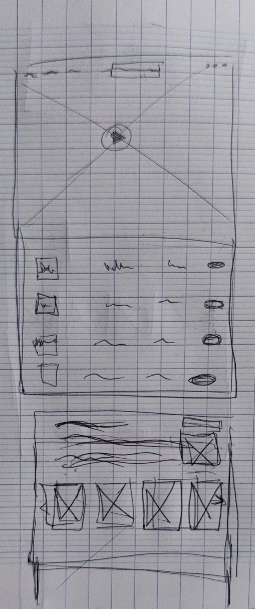
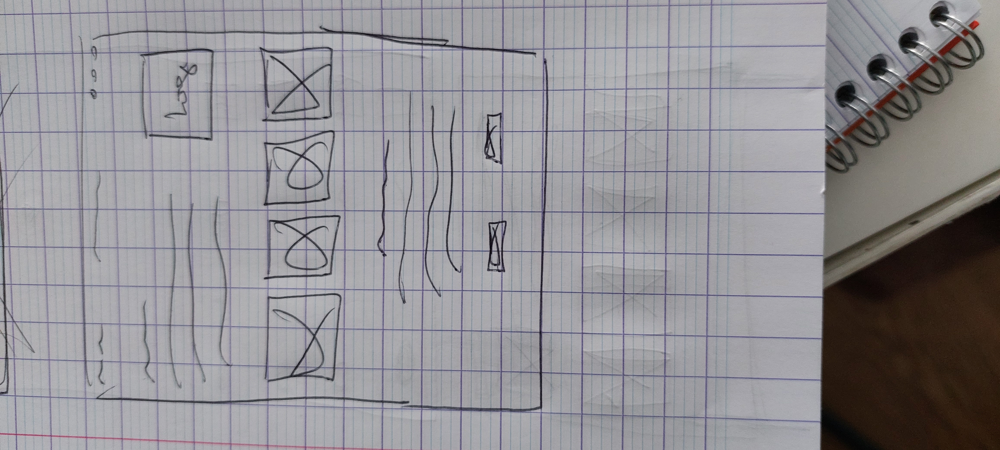
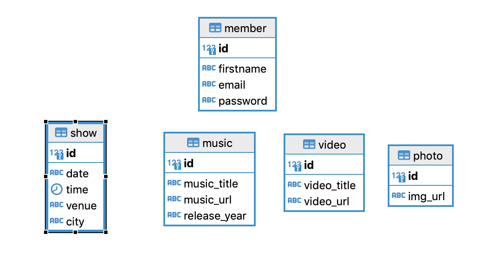

# Spade Diamonds
### Official Webiste


- Wireframe




- BDD



## Installation
- Après le clonage du repo faire un ```npm install``` dans les dossiers frontend et backend.

- Pour lancer le server aller dans le dossier backend et faire :
    ```
    npm start
    ```
- Pour lancer l'application aller dans le dossier frontend et faire :
    ```
    npm run dev
    ```


